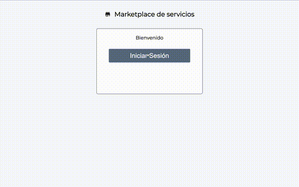
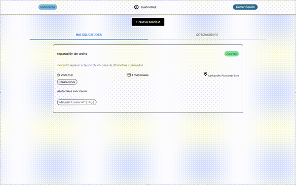
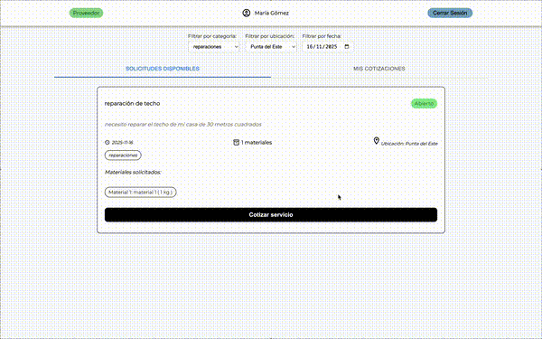
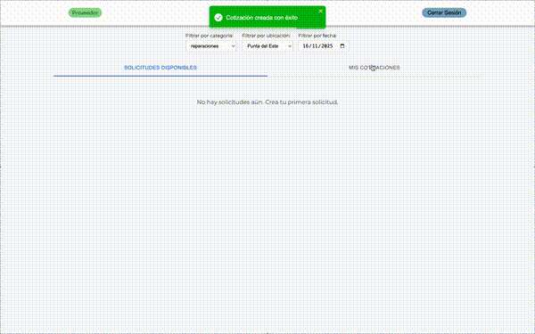
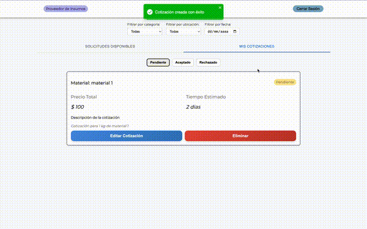
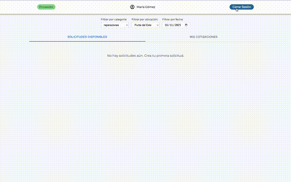
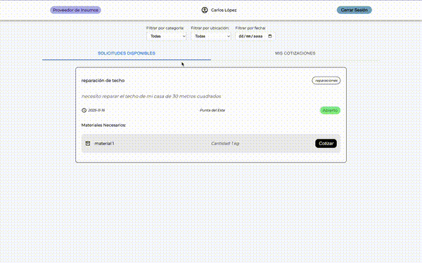
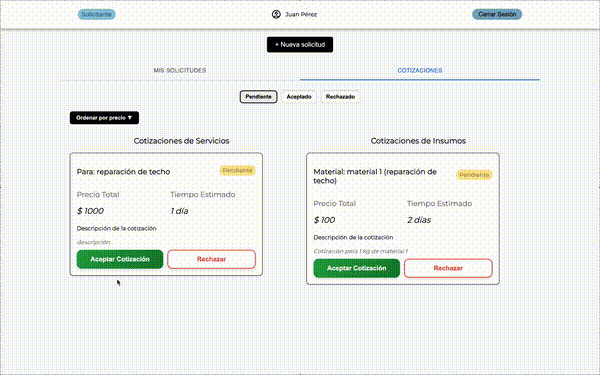
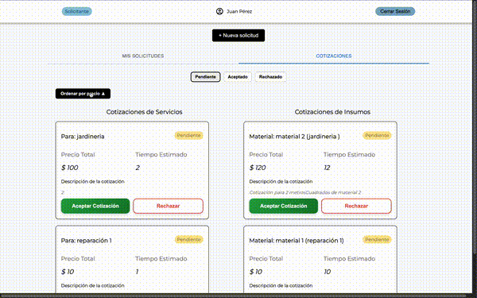

# Proyecto Marketplace de Servicios

## Descripción del proyecto
Este proyecto consiste en un Marketplace de Servicios, desarrollado con una plataforma web y una aplicación mobile. La plataforma permite la interacción entre tres tipos de usuarios, cada uno con un rol específico.

- **Solicitante:**  Publica servicios con título, descripción, categoría, ubicación, fecha deseada y materiales necesarios. Recibe cotizaciones de los proveedores de servicios y de insumos, las cuales puede comparar, ordenar por precio y seleccionar la más conveniente.
- **Proveedor de Servicios:** Visualiza los servicios publicados, pudiendo filtrarlos por categoría, ubicación y fecha. Envía cotizaciones indicando precio, plazo y detalles adicionales, y puede editarlas o retirarlas mientras el servicio aún no ha sido aceptado o rechazado.
- **Proveedor de Insumos:** Similar al proveedor de servicios, puede ver los servicios publicados y cotizar los materiales necesarios para cada solicitud, indicando precio, tiempo y detalles adicionales.

La plataforma permite que los servicios sean publicados, cotizados, comparados y finalmente seleccionados, asegurando un flujo claro y roles bien definidos.

En el caso de la aplicación mobile funciona de manera similar, solamente que contempla dos roles: Solicitante y Proveedor de Servicios.

## Decisiones técnicas

### Frameworks utilizados:
- Web desarrollada en React Vite. Mobile desarrollada con React Native (Expo)

### Gestión de estado:
Se utilizó `useState` para estados locales y `useContext` para los estados globales. 
    
**Mobile:**
- `AuthContext` → gestiona la sesión del usuario y la información asociada (nombre, rol, login/logout) y persiste la sesión en `localStorage`
- `SolicitudContext` → administra los servicios publicados: creación, edición, selección y filtrado.
- `CotizacionContext` → administra las cotizaciones de servicios, incluyendo agregar, editar y eliminar. Depende de `SolicitudContext` para sincronizar el estado de las solicitudes.

**Web**
- `AuthContext` → al igual que en mobile, gestiona la sesión y los datos del usuario activo.
- `ServicioContext` → combina las funcionalidades de solicitudes y cotizaciones, centralizando el flujo de datos de la plataforma web.

### Routing
- **Web:** `react-route-dom` con rutas públicas y privadas según el rol del usuario.
- **Mobile:** `React Navigation` con stacks y tabs para diferenciar pantallas según el rol (Solicitante, Proveedor de Servicios). 

### Mock de datos
- No se utiliza un backend real.
- Los usuarios están **hardcodeados** en archivos locales (`AuthContext`).
- Los servicios y cotizaciones se gestionan directamente en memoria a través de los Context (`SolicitudContext`, `CotizacionContext`) y se pierden al cerrar la aplicación.

### Persistencia básica:
- Se utiliza `localStorage` para mantener la sesión iniciada y la información del usuario activo.

### Diseño y UX:
- Interfaz simple y clara, priorizando la experiencia del usuario al publicar, cotizar y comprar servicios.
- Feedback visual mediante, toasts, estados de carga, y mensajes en caso de listas vacías.  

## Instrucciones para instalar y correr el programa
### Web
1. `cd marketplace-proyecto`
2. `npm install` o `yarn install`
3. `npm run dev` o `yarn dev`
4. Abrir `http://localhost:5173` en el navegador

### Mobile
1. `cd marketplace-mobile`
2. `npm install` o `yarn install`
3. `npm start`
4. Abrir en un emulador o dispositivo físico

## Usuarios hardcodeados
|       Email       |    Clave    |         Rol         |
|-------------------|-------------|---------------------|
| cliente@test.com  | cliente123  | Solicitante         |
| servicio@test.com | servicio123 | Proveedor            |
| insumos@test.com  | insumos123  | Proveedor de Insumos|

A continuación se muestra el flujo principal del uso de la plataforma web y mobile, desde la creación de solicitudes hasta la gestión de cotizaciones.
## Demo Web
### Flujo principal
1. Iniciar sesión como Solicitante

2. Crear una solicitud indicando título, descripción, categoría, ubicación, fecha límite y listar los materiales necesarios, nombre, unidad y cantidad.

3. Iniciar sesión como Proveedor

4. Filtrar solicitudes por categoría, ubicación y fecha

5. Seleccionar una y cotizarla indicando precio, tiempo estimado y detalles.

6. Se puede editar la cotización mientras se encuentre en estado pendiente

7. Se puede eliminar la cotización y volver a cotizarla mientras se encuentre en estado pendiente

8. Las cotizaciones pueden estar pendientes, aceptadas o rechazadas, se utiliza el tab para ver cada una

9. Iniciar sesión como Proveedor de Insumos

10. Cotizar materiales indicando precio, tiempo estimado y detalles (opcional)

11. El cliente puede aceptar o rechazar las cotizaciones

12. El cliente puede ordenar por precio las cotizaciones

## Demo Mobile
### Flujo principal

